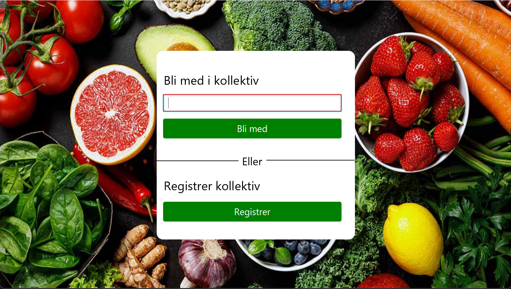
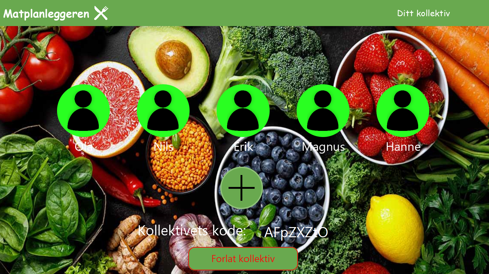
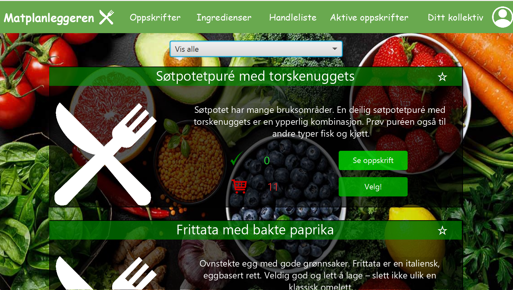
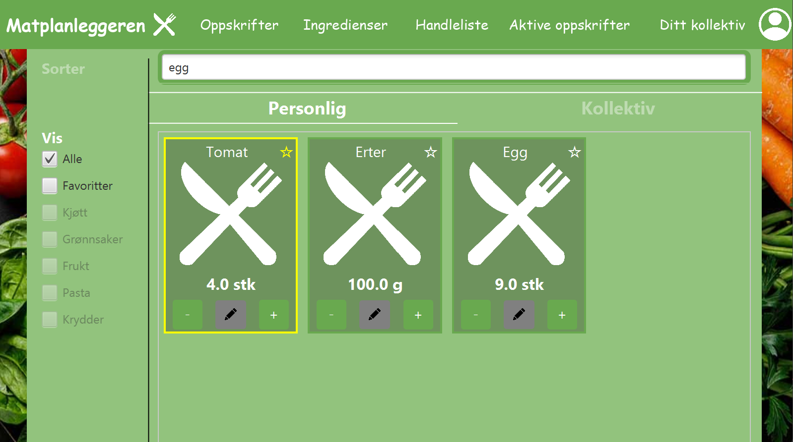

# 🍽️ The Food Planner

**The Food Planner** is a Java desktop application developed as part of the NTNU course **IDATG1005 - Systemdevelopment**.  
The goal of the application is to optimize meal planning, reduce food waste, and simplify grocery shopping in student households. 
🏆Awarded best application in the class by teacher and students🏆

---

## ✨ Features
- 📦 **Pantry management** – keep track of available ingredients and food inventory  
- 📖 **Recipe integration** – add recipes and connect them directly to meal plans  
- 🛒 **Automatic shopping list** – generate shopping lists based on planned meals, minimizing unnecessary purchases  
- 👥 **User-friendly interface** – designed with student households and shared living in mind  

---

## 🛠️ Technology
- **Language:** Java  
- **Methodology:** Scrum (3 iterations)
- **Database:** MySQL  
- **Testing:** Automated testing for quality assurance  
- **Environment:** Desktop application

(Must be connected to the NTNU network to run the application, f.eks with VPN).

---

